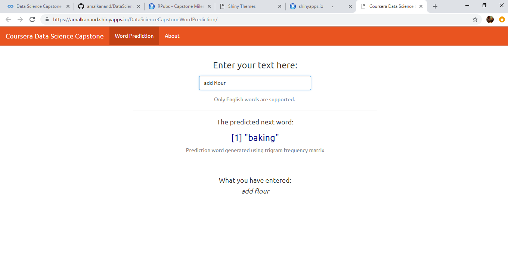

OVERVIEW
========================================================

* The core objective of this capstone is developing a Shiny app that can predict the next word based on a user input of words. This will be similar to the application that is used in mobile keyboards applications implemented by the [Swiftkey](https://swiftkey.com/en).

* There are many activities which was conducted including: 
  - Overview, Understanding the Problem, and Getting the Data. The data came from [HC Corpora](http://www.corpora.heliohost.org) with three files (Blogs, News and Twitter)
  - Exploratory Data Analysis and Modeling. The The milestone report can be accessed from the link [Milestone Report](http://rpubs.com/amalanand/470732).
  - Building the Prediction Model using tokenizationand n-grams
  - creative Exploration
  - Data Product
  - Creating the Presentation

APPROACHES and METHODS
========================================================
* After the data was loaded, a sample was created, cleaned and prepared to be used as a corpus of text. It was converted to lower case, removed the punctuation, links, whitespace and numbers.

* The sample text was "tokenized" into so-called n-grams to construct the predictive models (Tokenization is the process of breaking a stream of text up into words, phrases. N-gram is a contiguous sequence of n items from a given sequence of text).

* The n-grams files(unigram, bigram, trigram and quadgram) are matrices with frequencies of words, used into the algorithm to predict the next word based on the text entered by the user.
 
THE SHINY APPLICATION
========================================================

* The Shiny application allow the prediction of the next possible word based on given given input text

* The user entered the text in an input box, and in the other one, the application returns the most probability word to be used.The predicted word is obtained from the n-grams matrices, comparing it with tokenized frequency of 2, 3 and 4 grams sequences. 

ADDITIONAL INFO
========================================================

* The next word prediction app is hosted on shinyapps.io: [Shiny app](https://amalkanand.shinyapps.io/DataScienceCapstoneWordPrediction/)

* All the code and related scripts can be found in the GitHub repo: [GitHub](https://github.com/amalkanand/DataScienceCapstone)
